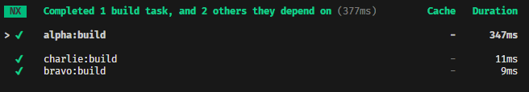
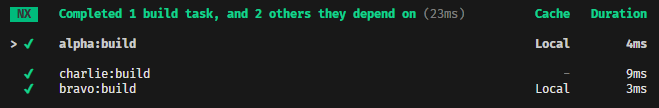
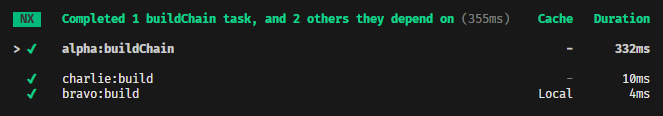

# Nx-Cache issue with dependsOn

This repo demonstrates the issue where a projects `dependsOn` chain does not invalidate the downstream cache when changes occur in a upstream project.

The problem occurs if a target defines a dependency on another target in `dependsOn` and any direct or indirect dependencies are changed invalidating their cache inputs. The `project.json` in `packages/alpha` defines build like this:

```json
"build": {
  "cache": true,
  "dependsOn": ["^build"],
  "inputs": ["project"],
  "outputs": ["{projectRoot}/built/**"],
  "executor": "nx:run-commands",
  "options": {
    "cwd": "{projectRoot}",
    "command": "vite build"
  }
}
```

Where the named input `project` defined in `nx.json` is:

```json
"namedInputs": {
  "project": ["{projectRoot}/**", "!{projectRoot}/node_modules/**", "!{projectRoot}/built/**"]
}
```

Resulting in this dependency chain:

```
alpha:build -> bravo:build -> charlie:build
```

Configured like this I would expect that if the cache key for `bravo:build` or `charlie:build` were to change (i.e. due to a code change) it would result in an invalidation of `alpha:build` as well. Otherwise what would be the point of declaring it as a dependency?

## Reproduce the problem

1. `nx reset` 
2. Run `nx run alpha:build` this caches output from `alpha:build`, `bravo:build` and `charlie:build`.



3. Run `nx run alpha:build` again. The cache is used


4. Make a change to charlie:

```diff
export const charlie = (message: string) => {
+	return `Inner wrap changed: ${message}`
}
```

5. Run `nx run alpha:build`. Only `charlie` is rebuilt.



This results in a built artifact `packages/alpha/built/alpha.js` containing old code.

```js title="packages/alpha/built/alpha.js"
import * as http from "node:http";
const charlie = (message) => {
  return `Inner wrap: ${message}`; // Notice this does not include " changed"
};
const bravo = (message) => {
  return charlie(`Outer wrap: ${message}`);
};
const port = 8088;
http.createServer(async (_, res) => {
  res.writeHead(200, {
    "Content-Type": "text/plain",
    "access-control-allow-origin": "*",
    "access-control-allow-methods": "GET, OPTIONS"
  });
  res.write(`Hello world @ ${(/* @__PURE__ */ new Date()).toISOString()}
From libs: ${bravo("Hello from API")}`);
  res.end();
}).listen(port);
console.log(`http://localhost:${port}`);
```

## Workaround

I can get the "correct" behaviour by adding `^project` to the inputs of `build` in `alpha` as shown in the `alpha:buildChain` target, but this would require that **alpha** knows what inputs should invalidate all dependent targets up the chain for all projects. This does not seem like a scalable workaround.

```json
"buildChain": {
  "cache": true,
  "dependsOn": ["^build"],
  "inputs": ["project", "^project"],
  "outputs": ["{projectRoot}/built/**"],
  "executor": "nx:run-commands",
  "options": {
    "cwd": "{projectRoot}",	
    "command": "vite build"
  }
}
```

